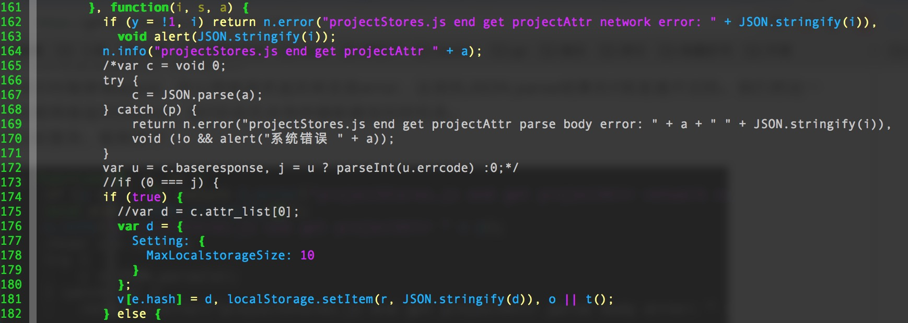
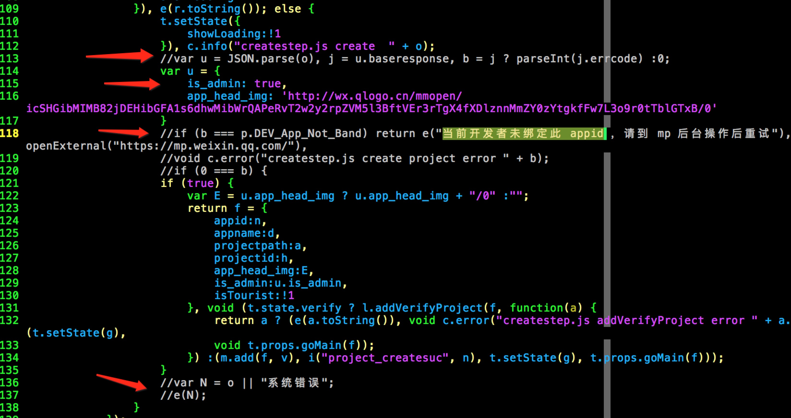
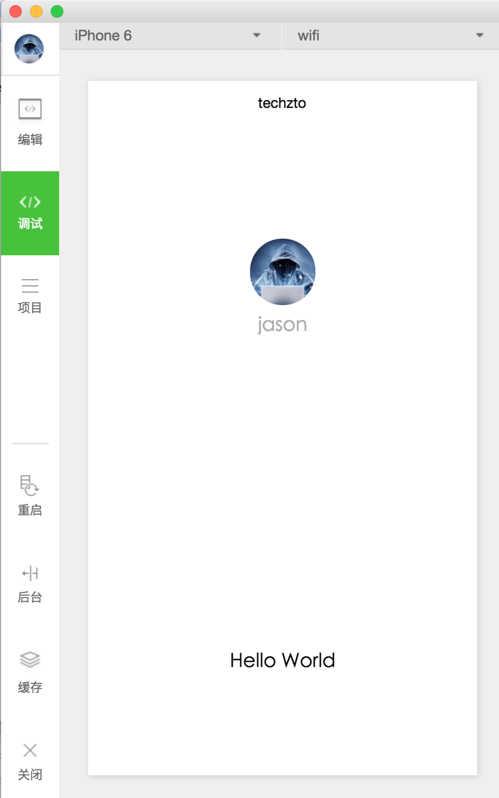

## 微信小程序的IDE用了reactjs + flux的架构  
可以分析它的源码学习这套框架  
首先非常感谢 https://github.com/gavinkwoe/weapp-ide-crack 的作者gavinkwoe的这个项目  
破解方式：把相应的文件做个替换就行。  

mac上：  
找到开发工具的程序，右击“显示包内容”：  
Resources/app.nw/app/dist/components/create/createstep.js  
Resources/app.nw/app/dist/stores/projectStores.js  
Resources/app.nw/app/dist/weapp/appservice/asdebug.js  

window上：  
安装完后，一般是放在这个目录里：C:\Program Files (x86)\Tencent\微信web开发者工具  
找到相应文件再替换：  
package.nw/app/dist/components/create/createstep.js  
package.nw/app/dist/stores/projectStores.js  
package.nw/app/dist/weapp/appservice/asdebug.js  
如果觉得麻烦，而且你也正巧用的mac，可以直接下载我传到百度云上的软件直接使用：https://pan.baidu.com/s/1dEATgkx ，版本 v0.10.101400  
 
破解的时候，把整个代码大概浏览了一遍，自己折腾了下。（因为之前写过react + flux的代码，所以对这个项目的结构非常熟悉。）   

主要的修改，如果你有兴趣可以浏览下：  
1、asdebug.js修改  
（1）搜索“URL 域名不合法，请在 mp 后台配置后重试”  
把这句代码前端的那个if改成if(false)就可以了  
这个主要是为了去掉安全域名的限制  
（2）搜索“URL 域名不合法，请在 mp 后台配置后，重启项目继续测试”
跟上面一样，把前面if改成if(false)  
这个修改主要是为了去掉websocket的安全名限制  
（3）搜索“__wxConfig.isTourist”，把它改成false  
这个修改是为了去掉游客身份。  

2、projectStores.js  
（1）搜索“setProjectConfig:function” 这个函数的定义  
把“i = e.isTourist”（不一定是i和e，不同的js格式化工具可能会有不一样的结果）这一小段注释掉，把下方的第一个if(i) { ... }整块注释掉。  
这一个用来判断是否是游客身份，是的话直接返回。但我们不想只是游客身份，所以这里我们不能让它返回，整个注释掉就行了。  
（2）在上面这个函数从上往下找try catch，把找到的第一个整块注释掉
然后把它下方的第一个if改成if(true)，if里的第一行var赋值语句的等号后面直接改成{}，空object。  
因为我们在创建项目时随便填appid，所以网络请求返回肯定是error，这里的JSON.parse结果在if里是通不过的。我们把这一整段注释掉，不去管网络返回的error。进if后会在本地存储新建项目的信息。  
这个地方的修改比较复杂，截图如下：  
<p align="center">

</p>  

3、createstep.js  
（1）搜索“当前开发者未绑定此 appid”  
把第一个if及周边的东西都注释掉，只执行下一个if。  
这个地方是创建的时候，返回用户信息的地方，上面说过我们创建时返回的肯定是error，所以这里自然也拿不到用户信息，反而是一个用户appId错误提示，所以这里我们动点手脚，把这个判断都注释掉，让它只执行用户信息返回的成功代码，同时我们创建一个假的用户信息object。  
这个修改比较复杂，截图如下：  
<p align="center">

</p>  


网络请求的接口，微信做了一些安全限制，要破解才能给任意地址发请求。websocket的接口也是一样。本项目的破解文件已经解决了这些问题。  

另外，创建出来的demo项目中，调用wx.login是不能成功的，所以改了demo的代码，在app.js里直接给globalData.userInfo赋值即可。  
```
init: function() {
  this.globalData.userInfo = {
    "nickName": "jason",
    "avatarUrl": "http://wx.qlogo.cn/mmopen/icSHGibMIMB82jDEHibGFA1s6dhwMibWrQAPeRvT2w2y2rpZVM5l3BftVEr3rTgX4fXDlznnMmZY0zYtgkfFw7L3o9r0tTblGTxB/0",
    "gender": 1,
    "province": "广东",
    "city": "深圳",
    "country": "中国",
  };
},
```
然后在`onLaunch`里调用一下init()就ok  


本项目文件的使用方法可以参考 https://github.com/gavinkwoe/weapp-ide-crack   
破解方式我自己重新折腾了一遍，有些地方跟gavinkwoe不太一样，不过都是可以正常运行的。  
版本 v0.10.101100 测试过，可以正常使用。  

另外，最近也在编写一些小程序的教程：  
> 《[【微信小程序开发•系列文章一】入门](http://www.jsongo.com/post/js/2016/weapp-1/)》  
> 《[【微信小程序开发•系列文章二】视图层](http://www.jsongo.com/post/js/2016/weapp-2/)》  
> 《[【微信小程序开发•系列文章三】数据层](http://www.jsongo.com/post/js/2016/weapp-3/)》  
> 《[【微信小程序开发•系列文章七】websocket](http://www.jsongo.com/post/js/2016/weapp-7/)》  
正在编写中的章节：  
《【微信小程序开发•系列文章四】模块化》  
《【微信小程序开发•系列文章五】主界面》  
《【微信小程序开发•系列文章六】生命周期和路由》    
《【微信小程序开发•系列文章八】常用组件》  


**几个问题说明**  

1. MaxRequestConcurrent报错的问题  
这个在本项目的破解文件里已经直接覆盖了，不会报这个错了。  
（修改：asdebug.js里，搜MaxRequestConcurrent，很简单，直接把它设置成固定数字即可）  

2. 页面切换时会出现route错误的问题  
这个可能是开发工作自身的bug，用一段时间后就会这样，目前还没发现原因，不过解决这个问题很简单，关掉，重新再开就好了。    

3. Failed to load resource: net::ERR_NAME_NOT_RESOLVED  
这个问题gavinkwoe的项目中也说明了，主要是由于代理导致的，打开ide，菜单上选“动作”->“设置”，选直连就行

<p align="center">

</p>

后续还会更新更多的api的破解方式，欢迎大家持续关注  

更多的微信小程序api，可以参考原官方文档：https://mp.weixin.qq.com/debug/wxadoc/dev/api/open.html  
